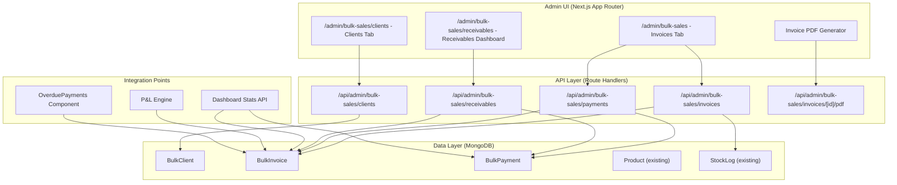
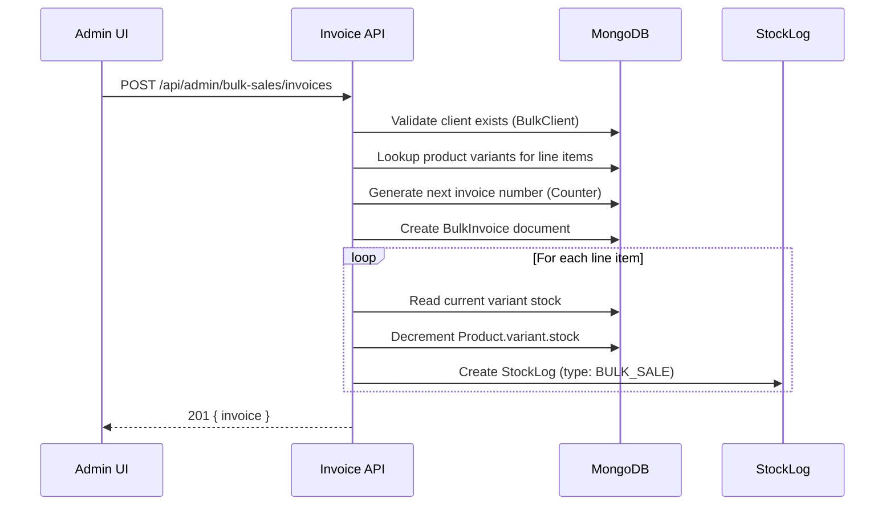
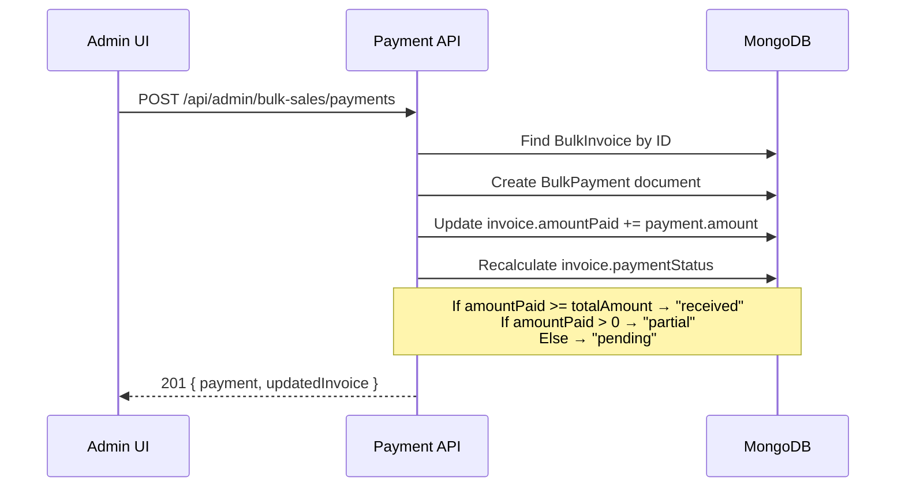

# Design Document: Bulk Sales CRM

## Overview

The Bulk Sales CRM module adds wholesale/B2B sales management to the Raven Fragrance admin panel. It replaces the current Excel-based tracking with a fully integrated system that manages bulk clients, creates invoices with line items, tracks partial payments, monitors receivables with aging analysis, and feeds bulk revenue/COGS into the existing CEO dashboard and P&L engine.

The module introduces three new Mongoose models (BulkClient, BulkInvoice, BulkPayment), a set of REST API routes under `/api/admin/bulk-sales`, and a multi-tab admin UI at `/admin/bulk-sales` following the existing design system (dark table headers, gold accents, cream backgrounds, modal CRUD pattern from the expenses page).

## Architecture




## Sequence Diagrams

### Create Invoice & Deduct Stock



### Record Partial Payment




## Components and Interfaces

### Component 1: BulkClient Management

**Purpose**: CRUD operations for wholesale client database with outstanding balance tracking.

**Interface**:
```javascript
// API: /api/admin/bulk-sales/clients
// GET    - List all clients with computed outstanding balances
// POST   - Create new client
// PATCH  /[id] - Update client details
// DELETE /[id] - Soft-delete client (only if no unpaid invoices)
```

**Responsibilities**:
- Maintain client contact info (name, phone, email, company, GST, address)
- Compute outstanding balance per client via aggregation on BulkInvoice
- Enforce credit limit warnings (soft limit, not blocking)
- Prevent deletion of clients with pending invoices

### Component 2: Invoice Management

**Purpose**: Create, view, edit bulk invoices with automatic numbering and stock deduction.

**Interface**:
```javascript
// API: /api/admin/bulk-sales/invoices
// GET    - List invoices with filters (client, status, dateRange)
// POST   - Create invoice (auto-number, deduct stock)
// PATCH  /[id] - Update invoice (recalculate totals)
// DELETE /[id] - Cancel invoice (restore stock if not paid)
// GET    /[id]/pdf - Generate PDF for invoice
```

**Responsibilities**:
- Auto-generate sequential invoice numbers (RVN-B001, RVN-B002...)
- Calculate line item totals, discounts, shipping, net revenue
- Deduct inventory via StockLog on creation
- Track payment status lifecycle (pending → partial → received)
- Generate downloadable PDF invoices


### Component 3: Payment Recording

**Purpose**: Record full or partial payments against bulk invoices.

**Interface**:
```javascript
// API: /api/admin/bulk-sales/payments
// GET    - List payments for an invoice or client
// POST   - Record payment against an invoice
// DELETE /[id] - Reverse/delete a payment (recalculate invoice status)
```

**Responsibilities**:
- Record payment amount, date, and mode (UPI/Cash/Bank Transfer)
- Update parent invoice's amountPaid and paymentStatus
- Support multiple partial payments per invoice
- Prevent overpayment (payment cannot exceed remaining balance)

### Component 4: Receivables Dashboard

**Purpose**: Aging analysis and outstanding balance visualization.

**Interface**:
```javascript
// API: /api/admin/bulk-sales/receivables
// GET - Returns aggregated receivables data:
//   { totalOutstanding, totalOverdue, agingBuckets, clientBreakdown }
```

**Responsibilities**:
- Aggregate total outstanding across all unpaid/partial invoices
- Compute aging buckets (0-30, 30-60, 60-90, 90+ days)
- Break down outstanding by client
- Identify overdue invoices (past due date)

### Component 5: Dashboard Integration

**Purpose**: Feed bulk sales data into existing CEO dashboard.

**Responsibilities**:
- Add bulk revenue to dashboard total revenue (monthly/all-time)
- Include bulk COGS in P&L calculations
- Show overdue bulk payments in OverduePayments component
- Contribute to net profit and gross margin calculations


## Data Models

### Model 1: BulkClient

```javascript
const BulkClientSchema = new mongoose.Schema({
  name: { type: String, required: true },
  company: { type: String, default: "" },
  phone: { type: String, required: true },
  email: { type: String, default: "" },
  gst: { type: String, default: "" },
  address: { type: String, default: "" },
  city: { type: String, default: "" },
  state: { type: String, default: "" },
  creditLimit: { type: Number, default: 0 }, // 0 = no limit
  notes: { type: String, default: "" },
  deleted: { type: Boolean, default: false },
}, { timestamps: true });

// Indexes
BulkClientSchema.index({ name: 1 });
BulkClientSchema.index({ deleted: 1 });
```

**Validation Rules**:
- `name` is required, trimmed, unique among active clients
- `phone` is required, must be valid Indian phone (10 digits)
- `gst` if provided must match GST format (15 chars alphanumeric)
- `creditLimit` must be >= 0

### Model 2: BulkInvoice

```javascript
const BulkInvoiceLineSchema = new mongoose.Schema({
  productId: { type: mongoose.Schema.Types.ObjectId, ref: "Product", required: true },
  productName: { type: String, required: true },
  variantSize: { type: String, required: true },
  sku: { type: String, default: "" },
  quantity: { type: Number, required: true, min: 1 },
  unitPrice: { type: Number, required: true, min: 0 },
  unitCost: { type: Number, default: 0 }, // from Product.variant.total_cost at invoice time
  discount: { type: Number, default: 0 }, // percentage or flat per line
  lineTotal: { type: Number, required: true }, // (unitPrice * qty) - discount
}, { _id: false });

const BulkInvoiceSchema = new mongoose.Schema({
  invoiceNumber: { type: String, required: true, unique: true }, // "RVN-B001"
  clientId: { type: mongoose.Schema.Types.ObjectId, ref: "BulkClient", required: true },
  clientName: { type: String, required: true }, // denormalized for quick display
  
  invoiceDate: { type: Date, required: true, default: Date.now },
  dueDate: { type: Date, required: true }, // default: invoiceDate + 30 days
  
  lineItems: { type: [BulkInvoiceLineSchema], required: true, validate: v => v.length > 0 },
  
  // Calculated totals
  subtotal: { type: Number, required: true },     // sum of all lineTotal
  shipping: { type: Number, default: 0 },
  totalDiscount: { type: Number, default: 0 },    // invoice-level discount
  totalAmount: { type: Number, required: true },   // subtotal - totalDiscount + shipping
  totalCogs: { type: Number, default: 0 },         // sum(unitCost * qty) per line
  grossProfit: { type: Number, default: 0 },       // totalAmount - totalCogs
  
  // Payment tracking
  amountPaid: { type: Number, default: 0 },
  paymentStatus: {
    type: String,
    enum: ["pending", "partial", "received"],
    default: "pending",
  },
  
  // Stock tracking
  stockDeducted: { type: Boolean, default: false },
  
  notes: { type: String, default: "" },
  deleted: { type: Boolean, default: false },
}, { timestamps: true });

// Indexes
BulkInvoiceSchema.index({ clientId: 1, invoiceDate: -1 });
BulkInvoiceSchema.index({ paymentStatus: 1, dueDate: 1 });
BulkInvoiceSchema.index({ deleted: 1, invoiceDate: -1 });
BulkInvoiceSchema.index({ invoiceNumber: 1 }, { unique: true });
```

**Validation Rules**:
- `lineItems` must have at least one item
- `totalAmount` = subtotal - totalDiscount + shipping
- `amountPaid` must be >= 0 and <= totalAmount
- `dueDate` defaults to invoiceDate + 30 days
- `paymentStatus` is derived: received if amountPaid >= totalAmount, partial if > 0, else pending


### Model 3: BulkPayment

```javascript
const BulkPaymentSchema = new mongoose.Schema({
  invoiceId: { type: mongoose.Schema.Types.ObjectId, ref: "BulkInvoice", required: true },
  clientId: { type: mongoose.Schema.Types.ObjectId, ref: "BulkClient", required: true },
  amount: { type: Number, required: true, min: 0.01 },
  paymentDate: { type: Date, required: true, default: Date.now },
  paymentMode: {
    type: String,
    enum: ["Cash", "UPI", "Bank Transfer", "Cheque"],
    default: "UPI",
  },
  reference: { type: String, default: "" }, // transaction ID or cheque number
  notes: { type: String, default: "" },
  deleted: { type: Boolean, default: false },
}, { timestamps: true });

// Indexes
BulkPaymentSchema.index({ invoiceId: 1, paymentDate: -1 });
BulkPaymentSchema.index({ clientId: 1, paymentDate: -1 });
```

**Validation Rules**:
- `amount` must be > 0 and <= remaining balance on invoice
- `invoiceId` must reference an existing non-deleted invoice
- `paymentDate` cannot be before invoice date

### Model 4: BulkInvoiceCounter (for sequential numbering)

```javascript
const BulkInvoiceCounterSchema = new mongoose.Schema({
  prefix: { type: String, required: true, unique: true }, // "RVN-B"
  seq: { type: Number, default: 0 },
});
```

**Usage**: `findOneAndUpdate({ prefix: "RVN-B" }, { $inc: { seq: 1 } }, { upsert: true, new: true })`
Generates: RVN-B001, RVN-B002, etc.


## Key Functions with Formal Specifications

### Function 1: createBulkInvoice()

```javascript
async function createBulkInvoice({ clientId, lineItems, shipping, totalDiscount, dueDate, notes })
// Returns: { success: true, invoice: BulkInvoice }
```

**Preconditions:**
- `clientId` references an existing, non-deleted BulkClient
- `lineItems` is non-empty array; each item has valid productId, variantSize, quantity > 0, unitPrice >= 0
- Each product/variant combination has sufficient stock (variant.stock >= item.quantity)
- `shipping` >= 0, `totalDiscount` >= 0
- If client has creditLimit > 0: existing outstanding + new totalAmount <= creditLimit (warning only)

**Postconditions:**
- New BulkInvoice document created with unique invoiceNumber
- For each line item: Product.variant.stock decremented by quantity
- For each line item: StockLog entry created with type "BULK_SALE"
- invoice.totalCogs = sum(lineItem.unitCost * lineItem.quantity)
- invoice.grossProfit = invoice.totalAmount - invoice.totalCogs
- invoice.paymentStatus = "pending"
- invoice.stockDeducted = true

**Invariants:**
- sum(lineItem.lineTotal) === invoice.subtotal
- invoice.totalAmount === invoice.subtotal - invoice.totalDiscount + invoice.shipping
- Product stock after = Product stock before - sum(quantities for that product/variant)

### Function 2: recordPayment()

```javascript
async function recordPayment({ invoiceId, amount, paymentDate, paymentMode, reference, notes })
// Returns: { success: true, payment: BulkPayment, invoice: BulkInvoice }
```

**Preconditions:**
- `invoiceId` references an existing, non-deleted BulkInvoice
- `amount` > 0
- `amount` <= (invoice.totalAmount - invoice.amountPaid) — cannot overpay
- `paymentDate` >= invoice.invoiceDate
- invoice.paymentStatus !== "received"

**Postconditions:**
- New BulkPayment document created
- invoice.amountPaid incremented by payment.amount
- invoice.paymentStatus updated:
  - "received" if amountPaid >= totalAmount
  - "partial" if amountPaid > 0 and < totalAmount
  - "pending" if amountPaid === 0
- No stock changes (stock deducted at invoice creation time)

**Invariants:**
- invoice.amountPaid === sum(all BulkPayment.amount for this invoice where deleted !== true)
- 0 <= invoice.amountPaid <= invoice.totalAmount


### Function 3: getReceivablesAnalysis()

```javascript
async function getReceivablesAnalysis()
// Returns: { totalOutstanding, totalOverdue, agingBuckets, clientBreakdown }
```

**Preconditions:**
- Database connection is active
- BulkInvoice collection exists

**Postconditions:**
- `totalOutstanding` = sum(totalAmount - amountPaid) for all non-deleted invoices where paymentStatus !== "received"
- `totalOverdue` = sum(totalAmount - amountPaid) for invoices where dueDate < today AND paymentStatus !== "received"
- `agingBuckets` computed based on days since dueDate:
  - current (0-30): dueDate is within 30 days from now or not yet due
  - bucket_30_60: 30 < daysOverdue <= 60
  - bucket_60_90: 60 < daysOverdue <= 90
  - bucket_90_plus: daysOverdue > 90
- `clientBreakdown` = grouped outstanding per clientId with client name

**Invariants:**
- totalOutstanding >= totalOverdue (overdue is subset of outstanding)
- sum(agingBuckets) === totalOutstanding
- sum(clientBreakdown amounts) === totalOutstanding

### Function 4: cancelInvoice()

```javascript
async function cancelInvoice(invoiceId)
// Returns: { success: true, invoice: BulkInvoice }
```

**Preconditions:**
- Invoice exists and is not deleted
- invoice.amountPaid === 0 (cannot cancel partially/fully paid invoice)

**Postconditions:**
- invoice.deleted = true
- If invoice.stockDeducted === true: restore stock for each line item
- For each restored line item: StockLog entry with type "BULK_SALE_CANCELLED"
- Product.variant.stock incremented by cancelled quantities

**Invariants:**
- After cancellation: Product stock = Product stock before cancel + sum(lineItem quantities)
- No BulkPayment records exist for this invoice (guaranteed by precondition amountPaid === 0)


## Algorithmic Pseudocode

### Invoice Number Generation

```javascript
async function generateInvoiceNumber() {
  const counter = await BulkInvoiceCounter.findOneAndUpdate(
    { prefix: "RVN-B" },
    { $inc: { seq: 1 } },
    { upsert: true, new: true }
  );
  return `RVN-B${String(counter.seq).padStart(3, "0")}`;
  // Produces: RVN-B001, RVN-B002, ..., RVN-B999, RVN-B1000
}
```

### Aging Bucket Calculation

```javascript
function computeAgingBuckets(invoices, today = new Date()) {
  const buckets = { current: 0, days_30_60: 0, days_60_90: 0, days_90_plus: 0 };
  
  for (const inv of invoices) {
    if (inv.paymentStatus === "received" || inv.deleted) continue;
    
    const outstanding = inv.totalAmount - inv.amountPaid;
    const daysOverdue = Math.max(0, Math.floor((today - new Date(inv.dueDate)) / 86400000));
    
    if (daysOverdue <= 30) buckets.current += outstanding;
    else if (daysOverdue <= 60) buckets.days_30_60 += outstanding;
    else if (daysOverdue <= 90) buckets.days_60_90 += outstanding;
    else buckets.days_90_plus += outstanding;
  }
  
  return buckets;
}
```

**Preconditions:**
- `invoices` is an array of BulkInvoice documents with totalAmount, amountPaid, dueDate, paymentStatus
- `today` is a valid Date object

**Postconditions:**
- Sum of all bucket values === total outstanding for non-received, non-deleted invoices
- Each invoice contributes to exactly one bucket

### Dashboard Integration — Bulk Revenue Aggregation

```javascript
async function getBulkRevenueForPeriod(startDate, endDate) {
  const result = await BulkInvoice.aggregate([
    {
      $match: {
        deleted: { $ne: true },
        invoiceDate: { $gte: startDate, $lte: endDate },
      },
    },
    {
      $group: {
        _id: null,
        totalRevenue: { $sum: "$totalAmount" },
        totalCogs: { $sum: "$totalCogs" },
        invoiceCount: { $sum: 1 },
      },
    },
  ]);
  
  return {
    revenue: result[0]?.totalRevenue || 0,
    cogs: result[0]?.totalCogs || 0,
    count: result[0]?.invoiceCount || 0,
    grossProfit: (result[0]?.totalRevenue || 0) - (result[0]?.totalCogs || 0),
  };
}
```


### Stock Deduction on Invoice Creation

```javascript
async function deductStockForInvoice(lineItems) {
  const stockLogs = [];
  
  for (const item of lineItems) {
    const product = await Product.findById(item.productId);
    const variant = product.variants.find(v => v.size === item.variantSize);
    
    const previousStock = variant.stock;
    const newStock = previousStock - item.quantity;
    
    // Update product variant stock
    await Product.updateOne(
      { _id: item.productId, "variants.size": item.variantSize },
      { $inc: { "variants.$.stock": -item.quantity } }
    );
    
    // Create stock log
    stockLogs.push({
      productId: item.productId,
      variantSize: item.variantSize,
      type: "BULK_SALE",
      quantity: -item.quantity,
      previousStock,
      newStock,
      reason: `Bulk invoice ${item.invoiceNumber}`,
      by: "admin",
    });
  }
  
  await StockLog.insertMany(stockLogs);
}
```

**Preconditions:**
- Each lineItem has valid productId and variantSize that exists in Product collection
- variant.stock >= item.quantity for each line item (checked before calling)

**Postconditions:**
- Product.variant.stock reduced by item.quantity for each line
- StockLog entry created for each deduction with type "BULK_SALE"
- stockLogs array length === lineItems.length

**Loop Invariant:**
- After processing item[i]: sum of all stock changes applied = sum(quantities[0..i])
- All stock logs created so far have accurate previousStock and newStock values


## Example Usage

### Creating a Bulk Invoice

```javascript
// POST /api/admin/bulk-sales/invoices
const response = await fetch("/api/admin/bulk-sales/invoices", {
  method: "POST",
  headers: { "Content-Type": "application/json" },
  body: JSON.stringify({
    clientId: "6651a2b3c4d5e6f7g8h9i0j1",
    lineItems: [
      {
        productId: "prod_rebel_id",
        variantSize: "50ml",
        quantity: 10,
        unitPrice: 599,
        discount: 10, // 10% discount
      },
      {
        productId: "prod_mystic_id",
        variantSize: "30ml",
        quantity: 5,
        unitPrice: 399,
        discount: 0,
      },
    ],
    shipping: 200,
    totalDiscount: 0,
    dueDate: "2025-02-15",
    notes: "Bulk order for Nitin Mahadik shop",
  }),
});
// Response: { success: true, invoice: { invoiceNumber: "RVN-B016", ... } }
```

### Recording a Partial Payment

```javascript
// POST /api/admin/bulk-sales/payments
const response = await fetch("/api/admin/bulk-sales/payments", {
  method: "POST",
  headers: { "Content-Type": "application/json" },
  body: JSON.stringify({
    invoiceId: "invoice_object_id",
    amount: 3000,
    paymentDate: "2025-01-20",
    paymentMode: "UPI",
    reference: "UPI-TXN-12345",
    notes: "First installment",
  }),
});
// Response: { success: true, payment: {...}, invoice: { amountPaid: 3000, paymentStatus: "partial" } }
```

### Fetching Receivables Dashboard

```javascript
// GET /api/admin/bulk-sales/receivables
const response = await fetch("/api/admin/bulk-sales/receivables");
const data = await response.json();
// Response: {
//   totalOutstanding: 15680,
//   totalOverdue: 4160,
//   agingBuckets: { current: 11520, days_30_60: 0, days_60_90: 3120, days_90_plus: 1040 },
//   clientBreakdown: [
//     { clientId: "...", clientName: "Nitin Mahadik", outstanding: 1040 },
//     { clientId: "...", clientName: "Nikita Pol", outstanding: 3120 },
//     ...
//   ]
// }
```


## Correctness Properties

### Property 1: Payment Consistency
For any invoice, `invoice.amountPaid === sum(BulkPayment.amount)` where payments are non-deleted and belong to that invoice.

### Property 2: No Overpayment
For any invoice, `invoice.amountPaid <= invoice.totalAmount` always holds.

### Property 3: Status Derivation
`paymentStatus` is always correctly derived:
- `amountPaid >= totalAmount` → "received"
- `0 < amountPaid < totalAmount` → "partial"
- `amountPaid === 0` → "pending"

### Property 4: Stock Integrity
After invoice creation, `Product.variant.stock = previousStock - sum(lineItem.quantity)` for affected variants.

### Property 5: Aging Completeness
`sum(agingBuckets) === totalOutstanding` — every outstanding rupee is in exactly one bucket.

### Property 6: Invoice Total Consistency
`invoice.totalAmount === sum(lineItems.lineTotal) - totalDiscount + shipping`

### Property 7: COGS Accuracy
`invoice.totalCogs === sum(lineItem.unitCost * lineItem.quantity)`

### Property 8: Gross Profit
`invoice.grossProfit === invoice.totalAmount - invoice.totalCogs`

### Property 9: Cancellation Reversibility
Cancelling an unpaid invoice restores stock to pre-invoice levels.

### Property 10: Dashboard Revenue Inclusion
Total revenue shown on dashboard = D2C Order revenue + Bulk Invoice revenue for the same period.

## Error Handling

### Error Scenario 1: Insufficient Stock

**Condition**: Creating invoice where product variant stock < requested quantity
**Response**: Return 400 with per-item stock availability: `{ error: "Insufficient stock", details: [{ productName, variantSize, available, requested }] }`
**Recovery**: UI highlights affected line items; admin adjusts quantities or restocks first

### Error Scenario 2: Overpayment Attempt

**Condition**: Recording payment where amount > (totalAmount - amountPaid)
**Response**: Return 400 with `{ error: "Payment exceeds remaining balance", remaining: totalAmount - amountPaid }`
**Recovery**: UI pre-fills max allowed amount; admin adjusts payment value

### Error Scenario 3: Cancel Paid Invoice

**Condition**: Attempting to cancel/delete an invoice with amountPaid > 0
**Response**: Return 400 with `{ error: "Cannot cancel invoice with existing payments. Reverse payments first." }`
**Recovery**: Admin must delete payments before cancelling the invoice

### Error Scenario 4: Delete Client with Outstanding

**Condition**: Attempting to delete a client who has unpaid invoices
**Response**: Return 400 with `{ error: "Client has outstanding invoices", invoiceCount, totalOutstanding }`
**Recovery**: Admin must resolve all invoices before deleting client


### Error Scenario 5: Concurrent Invoice Number Generation

**Condition**: Two simultaneous invoice creations racing for the same sequence number
**Response**: MongoDB's `findOneAndUpdate` with `$inc` is atomic — no collision possible
**Recovery**: N/A — handled by design via atomic counter

### Error Scenario 6: Product Deleted After Invoice

**Condition**: Product referenced in existing invoice gets soft-deleted
**Response**: Invoice retains denormalized product name, SKU, and cost data in lineItems
**Recovery**: Historical invoices remain accurate; only affects new invoice creation (deleted products won't appear in product picker)

## Testing Strategy

### Unit Testing Approach

- Test `computeAgingBuckets()` with various date scenarios (no overdue, all overdue, mixed)
- Test invoice total calculation (subtotal, discount, shipping combinations)
- Test payment status derivation logic (pending → partial → received transitions)
- Test invoice number generation (sequential, no gaps on concurrent calls)
- Test stock deduction logic (correct quantities, correct variants)

### Integration Testing Approach

- End-to-end invoice creation: verify stock deducted, StockLog created, totals correct
- Payment recording: verify amountPaid updates, status transitions
- Cancellation: verify stock restored, StockLog "BULK_SALE_CANCELLED" entries
- Dashboard integration: verify bulk revenue included in P&L aggregation
- Client deletion guard: verify rejection when outstanding invoices exist

### Property-Based Testing Approach

**Property Test Library**: fast-check (already used in JavaScript ecosystem)

- For any sequence of payments on an invoice, amountPaid never exceeds totalAmount
- For any set of invoices, sum of aging buckets always equals total outstanding
- For any invoice creation + cancellation cycle, stock returns to original value
- Invoice total calculation is idempotent given same inputs

## Performance Considerations

- **Indexes**: Compound indexes on (clientId + invoiceDate) and (paymentStatus + dueDate) for efficient filtering
- **Denormalization**: Client name stored on invoice to avoid joins in list views
- **Aggregation Pipeline**: Receivables dashboard uses MongoDB aggregation (not in-app loops) for O(1) queries regardless of invoice count
- **Pagination**: All list endpoints paginated (default 20 per page) to bound response size
- **Dashboard Query**: Bulk revenue aggregation runs as a single pipeline alongside existing D2C query (parallel Promise.all)


## Security Considerations

- All `/api/admin/bulk-sales/*` routes protected by admin session check (same as existing admin routes)
- Input validation on all POST/PATCH endpoints (Mongoose validation + explicit checks)
- Soft-delete pattern prevents accidental data loss (same as existing Order/Expense models)
- No sensitive financial data exposed to non-admin users
- PDF generation is server-side only, no client-side data manipulation

## Dependencies

### New Dependencies
- None required for core functionality (uses existing Mongoose, Next.js App Router)
- **Optional**: `@react-pdf/renderer` or `jspdf` for invoice PDF generation (can use HTML-to-PDF via browser print as v1 alternative)

### Existing Dependencies Used
- `mongoose` — MongoDB ODM (existing)
- `next` / `next/server` — API routes (existing)
- `next-auth` — Admin session protection (existing)
- `lucide-react` — Icons (existing)
- `tailwindcss` — Styling (existing)

### StockLog Integration
- Add new enum value `"BULK_SALE"` and `"BULK_SALE_CANCELLED"` to StockLog.type enum
- This requires a minor schema update to the existing StockLog model

### Dashboard Stats API Integration
- Modify `/api/admin/dashboard-stats/route.js` to include bulk revenue, COGS, and overdue amounts
- Modify OverduePayments component to accept both D2C overdue orders and bulk overdue invoices

### Sidebar Integration
- Add "Bulk Sales" menu item to AdminSidebar.jsx between "Expenses" and "Customers"
- Use `HandCoins` or `Receipt` icon from lucide-react
